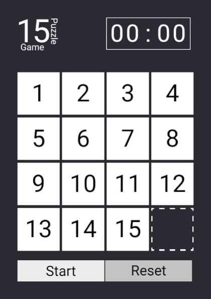

# 15-puzzle-game

## About

The 15 puzzle (also called Gem Puzzle, Boss Puzzle, Game of Fifteen, Mystic Square and many others) is a sliding puzzle having 15 square tiles numbered 1–15 in a frame that is 4 tiles high and 4 tiles wide, leaving one unoccupied tile position. Tiles in the same row or column of the open position can be moved by sliding them horizontally or vertically, respectively. The goal of the puzzle is to place the tiles in numerical order.

Read more about this game at [wiki](https://en.wikipedia.org/wiki/15_puzzle).

## Control

- → - move the left field to the right
- ← - move the right field to the left
- ↑ - move the bottom field to the up
- ↓ - move the up field to the bottom